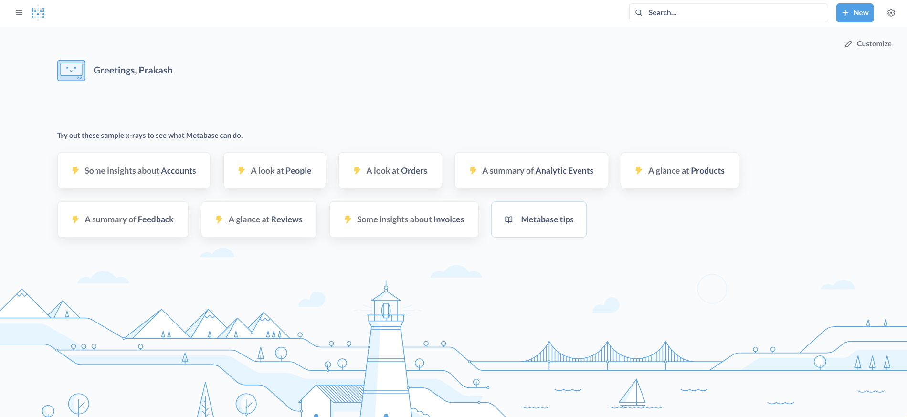
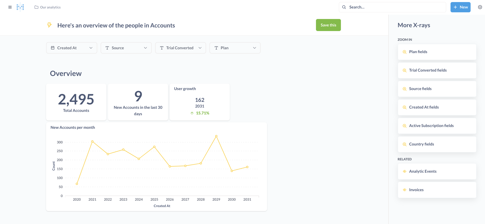

# Micro Data Warehouse

This project is an ETL (Extract, Transform, Load) pipeline for a microdatawarehouse built using PySpark and SQLite. It extracts data from SQLite tables, performs transformations on the data, and loads the transformed data back into SQLite tables. Additionally, it integrates with the Metabase data exploration and visualization tool.

## Project Overview

The MicroDataWarehouse project is designed to showcase an end-to-end ETL process for a small-scale data warehouse. The project consists of the following components:

1. **Data Generation**: A Python script (`data.py`) that creates an SQLite database and populates it with sample data for sales, customers, and employees.

2. **ETL Pipeline**: A PySpark script (`etl.py`) that extracts data from the SQLite database, performs various transformations on the data (e.g., calculating total revenue, finding top-selling products, and computing sales metrics by category), and then loads the transformed data back into the SQLite database.

3. **Execution Script**: A Bash script (`run_etl.sh`) that sets up the environment, executes the data generation and ETL pipeline scripts, and starts the Metabase server.

4. **Data Exploration**: The Metabase server is used to explore and visualize the transformed data stored in the SQLite database.

## Project Modules

### 1. `data.py`

This Python script creates an SQLite database named `microdatawarehouse.db` and populates it with sample data for the following tables:

- `sales`: Contains product information, including product ID, name, category, price, and quantity.
- `customers`: Contains customer details, including customer ID, name, region, and total purchases.
- `employees`: Contains employee information, including employee ID, name, department, and salary.


### 2. `etl.py`

This Python script implements the ETL pipeline using `PySpark`. It performs the following tasks:

- `Extract:` Reads data from the `sales`, `customers`, and `employees` tables in the SQLite database.
- `Transform:`
  - Calculates the total revenue from sales.
  - Finds the top 5 selling products based on quantity sold.
  - Calculates the average salary by department.
  - Identifies the top 3 high-value customers based on total purchases.
  - Calculates various sales metrics by product category (total quantity, average price, maximum price, minimum price, and number of products).
- `Load:` Writes the transformed data to new tables in the SQLite database (`total_revenue`, `top_selling_products`, `avg_salary_by_dept`, `high_value_customers`, `sales_metrics_by_category`).


### 3. `run_etl.sh`
This Bash script automates the execution of the ETL process and starts the Metabase server. It performs the following steps:

- Executes the `data.py` script to create the SQLite database and populate it with sample data.
- Executes the `etl.py` script to perform the ETL pipeline.
- Starts the Metabase server.

## Running the Example

To run the MicroDataWarehouse project, follow these steps:

1. Clone the repository or download the project files: 
```Bash
git clone https://github.com/prakash-aryan/MicroDataWarehouse.git
```

2. Download the required JAR files:
- Metabase JAR file: Download the latest version from [here](https://www.metabase.com/docs/latest/installation-and-operation/running-the-metabase-jar-file)
- SQLite JDBC driver JAR file: Download the latest version from [here](https://github.com/xerial/sqlite-jdbc/releases)

Place both JAR files in the project directory.

3. Create a virtual environment and activate it:
```Bash
python -m venv microdatawarehouse_venv
source microdatawarehouse_venv/bin/activate
```

4. Install the required Python dependencies:
```Bash
pip install pyspark==3.3.1 "py4j>=0.10.9.5,<0.10.9.6" findspark
```

5. Run the `run_etl.sh` script:
```Bash
chmod +x run_etl.sh
./run_etl.sh
```
6. Access the Metabase server at `http://localhost:3000`.

You can now explore and visualize the transformed data using the Metabase web interface.

## Metabase Interface

After running the example, you can access the Metabase interface and explore the transformed data. Here are some screenshots of the Metabase interface:

### Accounts Overview



This image shows the "Accounts Overview" section in Metabase. From here, you can access various insights and analytics related to accounts, such as user growth, new accounts per month, and more.

### Sample Dashboard



This image represents a sample dashboard in Metabase. The user can access any of the available dashboards or create new ones to visualize and analyze the transformed data.


## Contributing

Contributions are welcome! If you find any issues or have suggestions for improvements, please open an issue or submit a pull request.

## License

This project is licensed under the [MIT License](LICENSE).